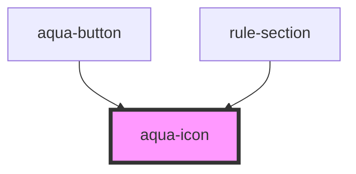

# aqua-icon

<!-- Auto Generated Below -->

## Properties

| Property | Attribute | Description | Type     | Default        |
| -------- | --------- | ----------- | -------- | -------------- |
| `height` | `height`  |             | `number` | `20`           |
| `icon`   | `icon`    |             | `string` | `"gauge_high"` |
| `type`   | `type`    |             | `string` | `"default"`    |
| `width`  | `width`   |             | `number` | `20`           |

## Dependencies

### Used by

 - [aqua-button](../aqua-button)
 - [rule-section](../rule-section)

### Graph

----------------------------------------------

*Built with [StencilJS](https://stenciljs.com/)*
