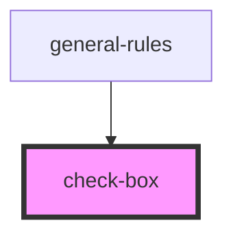

# check-box

<!-- Auto Generated Below -->

## Properties

| Property   | Attribute  | Description | Type      | Default |
| ---------- | ---------- | ----------- | --------- | ------- |
| `label`    | `label`    |             | `string`  | `''`    |
| `name`     | `name`     |             | `string`  | `''`    |
| `selected` | `selected` |             | `boolean` | `false` |

## Events

| Event           | Description | Type                   |
| --------------- | ----------- | ---------------------- |
| `checkedChange` |             | `CustomEvent<boolean>` |

## Dependencies

### Used by

 - [general-rules](../../molecules/general-rules)

### Graph

----------------------------------------------

*Built with [StencilJS](https://stenciljs.com/)*
