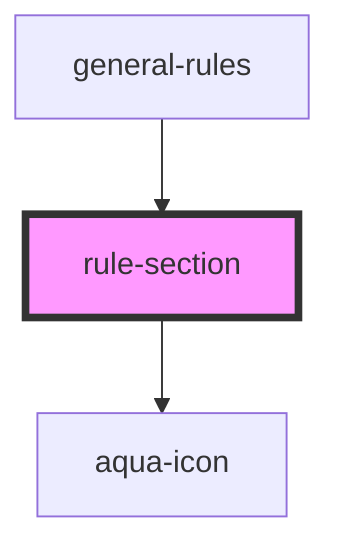

# rule-section

<!-- Auto Generated Below -->

## Properties

| Property  | Attribute | Description | Type     | Default |
| --------- | --------- | ----------- | -------- | ------- |
| `heading` | `heading` |             | `string` | `""`    |
| `icon`    | `icon`    |             | `string` | `""`    |

## Dependencies

### Used by

 - [general-rules](../../molecules/general-rules)

### Depends on

- [aqua-icon](../aqua-icon)

### Graph

----------------------------------------------

*Built with [StencilJS](https://stenciljs.com/)*
