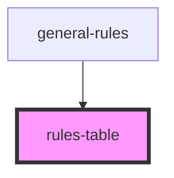

# rules-table

<!-- Auto Generated Below -->

## Properties

| Property  | Attribute | Description | Type    | Default |
| --------- | --------- | ----------- | ------- | ------- |
| `columns` | --        |             | `any[]` | `[]`    |
| `data`    | --        |             | `any[]` | `[]`    |

## Dependencies

### Used by

 - [general-rules](../../molecules/general-rules)

### Graph

----------------------------------------------

*Built with [StencilJS](https://stenciljs.com/)*
