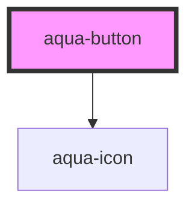

# aqua-button

<!-- Auto Generated Below -->

## Properties

| Property   | Attribute | Description | Type                                 | Default                     |
| ---------- | --------- | ----------- | ------------------------------------ | --------------------------- |
| `icon`     | `icon`    |             | `string`                             | `undefined`                 |
| `iconSize` | --        |             | `{ width: number; height: number; }` | `{ width: 16, height: 16 }` |
| `type`     | `type`    |             | `string`                             | `"primary"`                 |

## Dependencies

### Depends on

- [aqua-icon](../aqua-icon)

### Graph

----------------------------------------------

*Built with [StencilJS](https://stenciljs.com/)*
