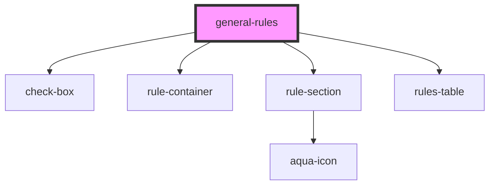

# general-rules

<!-- Auto Generated Below -->

## Dependencies

### Depends on

- [check-box](../../atoms/check-box)
- [rule-container](../../atoms/rule-container)
- [rule-section](../../atoms/rule-section)
- [rules-table](../../atoms/rules-table)

### Graph

----------------------------------------------

*Built with [StencilJS](https://stenciljs.com/)*
